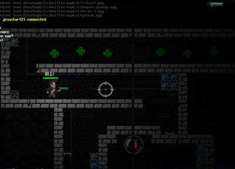

# D2D2 core
### Simple Java LWJGL-based 2D framework (Action Script 3.0-like DSL)

D2D2 is a simple 2D framework for the Java language, based on LWJGL (OpenGL), designed for game and application development. It focuses on ease of use and is heavily influenced by the ActionScript 3.0 paradigm, providing a familiar interface for working with display graph, events, and other core components.

## Features

- **Display Graph:** D2D2 provides classes for working with screen objects (DisplayObject), containers, as well as methods like addChild and removeChild for managing object display. All DisplayObject and their descendants retain basic properties and methods from ActionScript 3.0, such as x, y, rotation, alpha, scaleX, scaleY, visible, and others. This ensures a familiar interface for controlling the position, rotation, transparency, and scaling of objects on the scene.

- **Event Model:** Support for adding and removing event handlers via addEventListener and removeEventListener methods, simplifying the organization of event logic.

- **Screen Text:** Ability to display text using TrueType fonts, providing flexibility in formatting text elements.

- **User Input Handling:** The framework provides tools for handling user input through computer input devices, making it easy to create interactive applications.

- **Additional Tools and Utilities:** Additional tools are provided within the project, including working with textures, sound effects, and other features inspired by ActionScript 3.0 functionality.

## Project Goal

The goal of D2D2 is to create an easy-to-use framework for rapid development of 2D games and applications in the Java language. I aim to provide developers with tools that allow them to focus on the creative process and achieve desired results without unnecessary difficulties.

## A basic example of initializing and creating a simple animation:
```java
public static void main(String[] args) {
    // Initializing the framework
    Stage stage = D2D2.init(new LWJGLBackend(800, 600, "Window title"));
    
    // Creating a sprite
    Sprite sprite = new Sprite("image-source");
    
    // Adding an event listener triggered on each frame to rotate the sprite
    sprite.addEventListener(Event.ENTER_FRAME, e -> {
        sprite.rotate(0.01f);
    });
    
    // Setting the position of the sprite
    sprite.setXY(400, 300);
    
    // Adding the sprite to the stage
    stage.add(sprite);
    
    // Starting the rendering and event handling loop
    D2D2.loop();
}
```
## Demo videos
### Multiplayer game (Click on the picture to watch the video)
[](https://www.youtube.com/watch?v=YrSkHELR89w)<br/><a href="https://www.youtube.com/watch?v=YrSkHELR89w" target="_blank">Watch the video</a>
### Window manager (Click on the picture to watch the video)
[](https://www.youtube.com/watch?v=P3SNHOAOBMo)<br/><a href="https://www.youtube.com/watch?v=P3SNHOAOBMo" target="_blank">Watch the video</a>

## Include in your project:

To include the D2D2 library in your Maven project, add the following to your `pom.xml`:

In the `<repositories>` section:

```xml
<repository>
    <id>ancevt</id>
    <url>https://packages.ancevt.com/releases</url>
    <snapshots>
        <enabled>false</enabled>
        <updatePolicy>always</updatePolicy>
    </snapshots>
</repository>
<repository>
    <id>ancevt-snapshot</id>
    <url>https://packages.ancevt.com/snapshots</url>
    <snapshots>
        <enabled>true</enabled>
        <updatePolicy>always</updatePolicy>
    </snapshots>
</repository>
```

And in the `<dependencies>` section:

```xml
<dependency>
    <groupId>com.ancevt.d2d2</groupId>
    <artifactId>d2d2-core</artifactId>
    <version>0.1.5.2-beta</version>
</dependency>
```

## Contribution
Contributions to the D2D2 project are welcome. If you have ideas, suggestions, or bug fixes, please open a new issue or create a pull request in our GitHub repository.

## License
D2D2 is distributed under the Apache 2.0 license. Details can be found in the LICENSE file.
